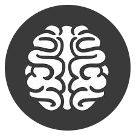

# 
 Arizona AI and ML Association [AAMA]
#

<i>Join us!</i>  http://www.meetup.com/Phoenix-AI-Machine-Learning-Meetup/  

<h4>Our Mission Statement:</h4>
To solve increasingly complex challenges, Homo Sapiens must think critically and creatively. The Arizona AI and ML Association [AAMA] seeks to provide the community with 
new means for technology, business, and innovation ideas. We have a braintrust of individuals and are maintaining active code. We hope these resources drive Arizona 
toward becoming the most knowledgeabe region in the world for Artificial Intelligence and Machine Learning.
 

..... <i>"A lot of people are scared of Artificial Intelligence."</i> 
<b>Don't be. It's just math.</b>

<h4>Artificial Intelligence (vs) Machine Learning</h4>
<b>Machine Learning</b> is about building programs with tunable parameters (typically an array of floating point values) that are adjusted automatically to improve their 
behavior by adapting to previously seen data.

Machine Learning can be considered a subfield of <b>Artificial Intelligence</b>. ML algorithms are building blocks to make computers learn to behave more intelligently. 
This is accomplished by generalizing rather that just storing and retrieving data items like a database system would do.

<b>Artificial Intelligence</b> is the application. <b>Machine Learning</b> is the math.

<h4>How To Contribute & Required Skills</h4>
If you can interface with other people and computers, <i>you will fit right in</i>. We're not elitist or profiteers. We see you as a fellow Homo Sapien that already adds 
value to who we are. Come hang out with us or donate code. We're working to solve some relevant and exciting problems.

<h4>Competitions & Meetups</h4>
<b>Competitions</b> 
Kaggle: Statefarm Distracted Driver Detection: https://www.kaggle.com/c/state-farm-distracted-driver-detection 
 
<b>Meetups</b> 
June 4th, 2016: <b>A Great Suggestion</b> - http://www.meetup.com/Phoenix-AI-Machine-Learning-Meetup/events/230972885/ 
May 7th, 2016: <b>A Learning Machine</b> - http://www.meetup.com/Phoenix-AI-Machine-Learning-Meetup/events/230500542/ 
